<div align="center">

# ohnoo

**Your terminal just crashed. Here's a joke about it — and the actual fix.**



[](LICENSE)
[](pyproject.toml)
[](#privacy-in-one-sentence)

</div>

---

Every developer knows this moment: a command exits non-zero, the terminal
fills with a wall of red, and you have to actually *read* it. Nobody wants
to read it. `ohnoo` reads it for you, matches it against a local database of
**102 known ways your code embarrasses you**, and hands back one funny line
and the real fix command — usually before you've finished scrolling up to
find where the traceback actually starts.

It will not comfort you. It will roast you, correctly, and then tell you
exactly what to type next.

```bash
pip install ohnoo && ohnoo init
```

That's the whole setup. No account, no API key, no config file to write.

## See it happen

```text
$ python app.py
Traceback (most recent call last):
ModuleNotFoundError: No module named 'requests'
ohnoo: Python looked everywhere for 'requests' and found nothing, much like your test coverage.
  fix: pip install requests
```

```text
$ node server.js
Error: listen EADDRINUSE :::3000
ohnoo: Port 3000 is already taken. By you. Twenty minutes ago.
  fix: lsof -ti :3000 | xargs kill -9
```

```text
$ git status
fatal: not a git repository
ohnoo: This isn't a git repo. It's just a folder with dreams.
  fix: git init
```

Real patterns, real jokes, real fix commands — pulled straight from
[`src/ohnoo/patterns/`](src/ohnoo/patterns/), not written for this README.

Want to watch it live instead of reading a code block? The
[landing page](landing/) has an animated terminal doing exactly this — run
it with `cd landing && npm install && npm run dev`.

## Pick a personality

The joke is swappable; the fix never is.

| `--vibe` | Same crash, different mood |
|---|---|
| `default` | *"Python looked everywhere for 'requests' and found nothing, much like your test coverage."* |
| `gordon-ramsay` | *"IT'S NOT INSTALLED! 'requests' IS RAW! You forgot to pip install it, you donut!"* |
| `zen` | *"The module 'requests' does not yet exist in your environment. This too can be resolved."* |
| `sarcastic-senior-dev` | *"'requests' isn't installed. Yes, again. pip install exists for a reason."* |

```bash
ohnoo vibe gordon-ramsay   # set a default
ohnoo --vibe zen fix       # or override it for one run
```

## How it actually works

`ohnoo` is a cascade of four layers, each one lazier than the last — every
one only runs if the layer above it gave up first, and every layer degrades
gracefully. Worst case, you get a plain "no idea what this is" and a shrug.
That's still better than what you had before.

```
crash happens
     │
     ▼
┌────────────────────────────┐
│ 1. Pattern engine           │  offline, instant, always on
│    102 known errors matched │  zero network calls
└──────────────┬───────────────┘
               │ not recognized
               ▼
┌────────────────────────────┐
│ 2. CLI agent handoff        │  ohnoo explain / ohnoo fix
│    claude, codex, or agy    │  confirmation required, every time
└──────────────┬───────────────┘
               │ no agent installed
               ▼
┌────────────────────────────┐
│ 3. MCP server               │  passive — ohnoo mcp-server
│    any MCP-aware IDE/agent  │  never calls out on its own
└──────────────┬───────────────┘
               │ no MCP client
               ▼
┌────────────────────────────┐
│ 4. Hosted LLM fallback      │  off by default
│    ohnoo setup-ai           │  stores the env var NAME, never the key
└────────────────────────────┘
```

## Commands

| Command | What it does |
|---|---|
| `ohnoo init [--shell bash\|zsh\|fish\|powershell]` | Install the shell hook. Idempotent — safe to run twice. |
| `cmd 2>&1 \| ohnoo` | Manual pipe mode. No hook required, works in CI. |
| `ohnoo explain` | Read-only: ask an installed AI agent to diagnose the last error. |
| `ohnoo fix` | Same, but the agent may edit files. Always confirms first. |
| `ohnoo vibe [name]` | Show or persist your default personality pack. |
| `ohnoo share` | Render the last roast as a shareable terminal-style PNG. |
| `ohnoo stats` | Local-only roast counts. Nothing leaves your machine. |
| `ohnoo setup-ai [--disable]` | Configure the opt-in hosted fallback, or turn it back off. |
| `ohnoo mcp-server [--port]` | Start the Layer 3 server for MCP-aware agents/IDEs. |

## Privacy, in one sentence

Layer 1 (the one that handles almost every crash) is pure local pattern
matching with zero network code in the path at all; Layer 4 is opt-in,
off by default, and even when configured it stores only the *name* of the
environment variable holding your API key — never the key itself.

## Contributing a pattern

Don't recognize an error? Adding one is a JSON entry, not a PR that touches
code. See [docs/pattern-contribution.md](docs/pattern-contribution.md).

## Project layout

- [`src/ohnoo/`](src/ohnoo/) — the CLI itself
- [`landing/`](landing/) — the React landing page (run it locally to see the live demo)
- [`docs/`](docs/) — architecture notes, MCP integration guide, launch drafts
- [`CLAUDE.md`](CLAUDE.md) — the full build spec and phase-by-phase history

## License

MIT. Roast responsibly.
